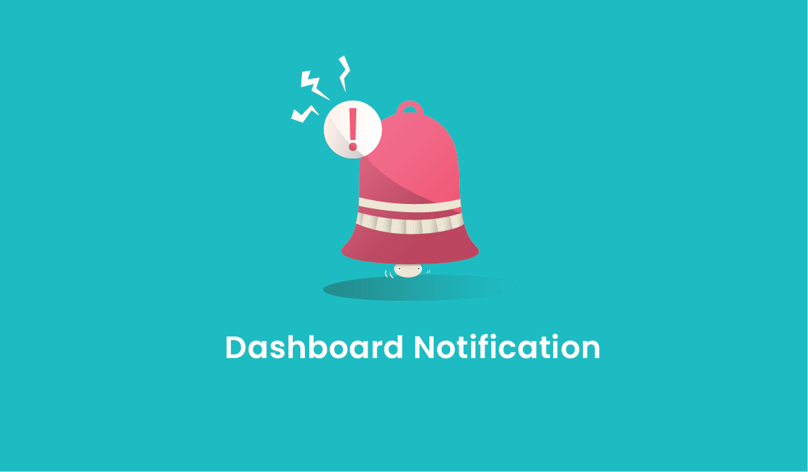
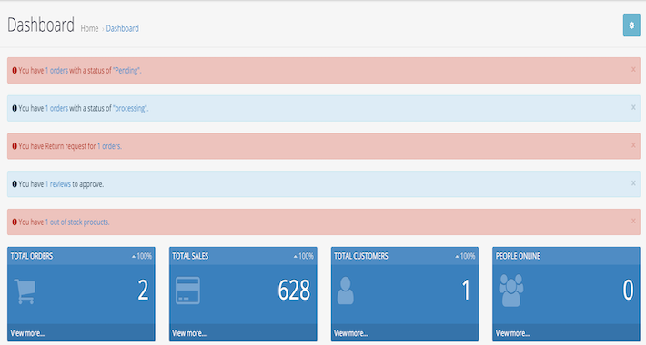

# AdminDashboardNotificationOpencart
Order/Product/Return/Review Dashboard Notifications - Opencart 3x

This module is useful to show notification alerts in the dashboard.
In OpenCart 3x versions, there is no order notification system in admin as in 2x and older versions.
The module is very easy to install and use. Once installed, it does not require any additional configurations or tweaking of settings.
Notification will be shown for pending, processing orders, out-of-stock products, new reviews, and return requests.

If there is no new order then the notification will not be shown.
Similarly, if there is no new review then the notification will not be shown.
If you set return history to complete then the Return Notification will disappear.

NOTE: It will show alerts only which order statuses you assigned to processing order statuses in the store setting.

OpenCart Marketplace link: https://www.opencart.com/index.php?route=marketplace/extension/info&extension_id=42404

